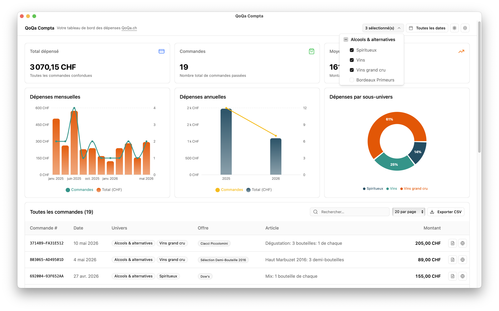

# QoQa Compta

<p align="center">
  
</p>

Spending dashboard for [QoQa.ch](https://www.qoqa.ch) — automatically syncs your orders and PDF invoices to a local SQLite (or PostgreSQL) database and displays spending charts, stats, and a searchable orders table.

> *This is an unofficial, independent open-source project. It is not affiliated with, endorsed by, or connected to QoQa Services SA.*

## Features

- **Stats cards** — total spent, number of orders, average per order
- **Spending charts** — monthly and yearly bar + line charts
- **Category filter** — filter all data by QoQa universe/sub-universe
- **Date range filter** — narrow every chart, card and table to a period
- **Orders table** — searchable, paginated list of all orders
- **Invoice PDF viewer** — opens stored invoices in an in-app popup, and saves them to your Downloads folder
- **CSV export** — download whatever the current filters select as a spreadsheet
- **Settings modal** — configure credentials, database URL, sync locale, and UI language; trigger a full or incremental sync with a live progress log

<p align="center">
  
</p>

## Getting started

Desktop apps are available for both macOS (Apple Silicon) and Windows, get them on the [releases page](https://github.com/nyg/qoqa-compta/releases). For Linux, only the web app is available.

### macOS

**Manual** — download [`qoqa-compta-…-macos-arm64.dmg`](https://github.com/nyg/qoqa-compta/releases/latest), open it and drag **QoQa Compta.app** into your **Applications** folder. The app is **not notarized**, so macOS quarantines it after download and blocks the first launch (you may see *"Apple could not verify…"* or *"QoQa Compta.app is damaged"*). To let it through, open **System Settings → Privacy & Security**, scroll to the bottom and click **Open Anyway** next to *"QoQa Compta.app" was blocked to protect your Mac*. Alternatively, remove the quarantine flag yourself using the terminal:

```sh
xattr -dr com.apple.quarantine "/Applications/QoQa Compta.app"
```

**[Homebrew](https://brew.sh)** — handles the above automatically:

```sh
brew install --cask nyg/tap/qoqa-compta
```

### Windows

**Manual** — download [`qoqa-compta-…-windows-x64-setup.exe`](https://github.com/nyg/qoqa-compta/releases/latest) and run it. It installs to `%LOCALAPPDATA%` (`C:\Users\<you>\AppData\Local` — no admin rights needed). The app is not code-signed, so the SmartScreen will show *"Windows protected your PC"* on first run — click **More info → Run anyway** (offered only to administrators).

**[Scoop](https://scoop.sh)** — for power users:

```powershell
scoop install git
scoop bucket add nyg https://github.com/nyg/scoop-bucket
scoop install qoqa-compta
```

If you don't have Scoop at all, you can install it with:

```powershell
irm get.scoop.sh | iex
```

### Web app

If you prefer not to install the app, you can run the server and access the app in your browser. QoQa Compta uses [Bun](https://bun.sh).

```bash
bun install

# Starts the Hono API on :3001 and the Vite dev server on :3000 concurrently.
# Open http://localhost:3000.
bun run dev

# Starts the Electrobun desktop app.
bun run desktop:dev

# Builds the app, see `build/` and `artifacts/`.
bun run build:stable
```

## Tech stack

| Layer | Technology |
|---|---|
| **Backend** | [Hono](https://hono.dev/) on [Bun](https://bun.sh) — REST API + sync engine |
| **Frontend** | [Vite](https://vitejs.dev/) SPA — React 19, React Router v7, Tailwind v4 |
| **Desktop** | [Electrobun](https://github.com/blackboardsh/electrobun) — native macOS & Windows app |
| **Database** | SQLite (default, via `bun:sqlite`) or PostgreSQL (via `@neondatabase/serverless`) |
| **i18n** | [react-i18next](https://react.i18next.com/) — 5 locales: en, fr, de, it, rm |
