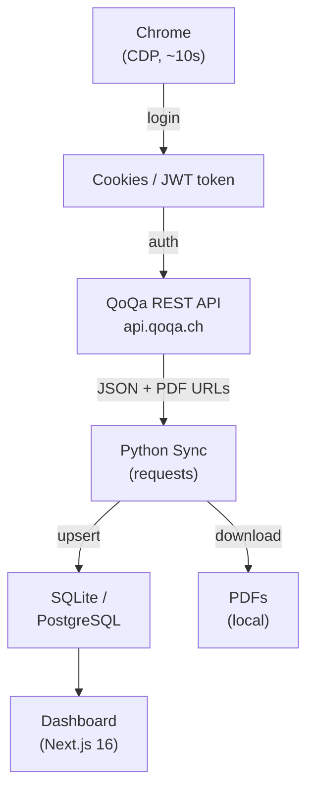

# Architecture

## Overview

The crawler logs in to QoQa.ch via the browser (just for authentication), then
uses the QoQa REST API to fetch all order data and download PDF invoices.



---

## Project structure

```
qoqa-compta/
├── .gitignore
├── renovate.json
├── README.md
├── docs/
│   └── architecture.md       # this file
├── crawler/                  # Python code
│   ├── .env.example
│   ├── requirements.txt
│   ├── crawler/
│   │   ├── __init__.py
│   │   ├── __main__.py       # CLI entry point
│   │   ├── sync.py           # Main synchronisation logic (CLI)
│   │   ├── api.py            # QoQa REST API client
│   │   ├── browser.py        # Browser login only (SeleniumBase CDP)
│   │   ├── db.py             # SQLAlchemy connection and session
│   │   ├── models/
│   │   │   ├── __init__.py
│   │   │   ├── order.py      # SQLAlchemy QoqaOrder model
│   │   │   ├── universe.py   # SQLAlchemy QoqaUniverse model
│   │   │   └── subuniverse.py  # SQLAlchemy QoqaSubuniverse model
│   │   └── utils/
│   │       ├── __init__.py
│   │       └── pdf_parser.py # PDF parsing with pdfplumber
└── frontend/                 # Next.js application
    ├── .env.example
    ├── package.json
    ├── tsconfig.json
    ├── next.config.ts
    ├── playwright.config.ts  # Playwright E2E test configuration
    ├── components.json       # shadcn/ui config (base-mira / Base UI preset)
    ├── messages/             # next-intl message files (en, fr, de, it, rm)
    ├── tests/
    │   ├── universe-picker.spec.ts  # E2E: hierarchical picker behaviour
    │   └── orders-table.spec.ts     # E2E: two-pill universe display
    └── src/
        ├── app/
        │   ├── globals.css
        │   ├── layout.tsx
        │   ├── page.tsx      # Main dashboard (dynamic, reads ?universes= + ?subuniverses= params)
        │   └── api/
        │       └── orders/
        │           └── route.ts  # Paginated orders + aggregate data endpoint
        ├── components/
        │   ├── ui/               # shadcn/ui primitives (Base UI wrappers)
        │   ├── universe-picker.tsx   # Hierarchical universe+subuniverse filter (client)
        │   ├── orders-table.tsx      # Filterable, paginated orders table (client)
        │   ├── spending-chart.tsx    # Monthly + yearly Recharts charts (client)
        │   ├── stats-cards.tsx       # Aggregate stat cards (server)
        │   ├── theme-provider.tsx
        │   └── theme-toggle.tsx
        ├── i18n/
        │   └── request.ts    # next-intl locale detection from Accept-Language
        ├── lib/
        │   ├── db.ts             # Drizzle ORM client (SQLite or PostgreSQL)
        │   ├── formatter-context.tsx  # React context for fr-CH formatters
        │   ├── formatters.ts     # formatCHF, formatDate, formatMonth helpers
        │   ├── queries.ts        # All DB query functions (Drizzle ORM)
        │   ├── schema.ts         # Drizzle schema (qoqa_orders + qoqa_universes + qoqa_subuniverses)
        │   └── utils.ts          # cn() and other utilities
        └── types/
            └── order.ts          # QoqaOrder, UniverseOption, SubuniverseOption, OrderStats, MonthlySpending, YearlySpending
```

---

## Database

The crawler automatically creates the tables on first run (via SQLAlchemy `create_all`)
and runs idempotent migrations (column renames) via `run_migrations()` before `create_all`.

### SQLite (default)

No setup required. The crawler creates the database file and its parent directory
automatically. Both the crawler and frontend must point to the same absolute path.

WAL mode and a 5-second busy timeout are enabled automatically so concurrent
reads (frontend) and writes (crawler) don't deadlock.

### PostgreSQL (optional)

Set `DATABASE_URL` to a PostgreSQL connection string in both `crawler/.env` and
`frontend/.env.local`. Useful when deploying the frontend to Vercel.

### Table structure

```sql
CREATE TABLE qoqa_orders (
    id               SERIAL PRIMARY KEY,
    order_number     VARCHAR(64) UNIQUE NOT NULL,
    order_date       DATE NOT NULL,
    amount_chf       NUMERIC(10, 2) NOT NULL,
    status           VARCHAR(32),
    subtotal_chf     NUMERIC(10, 2),
    discount_chf     NUMERIC(10, 2),
    vat_chf          NUMERIC(10, 2),
    delivery_on      DATE,
    offer_id         VARCHAR(32),
    offer_title      VARCHAR(255),
    offer_subtitle   VARCHAR(255),
    universe         VARCHAR(64),   -- universe_tracking_identifier (FK → qoqa_universes)
    subuniverse      VARCHAR(64),   -- cleaned identifier (FK → qoqa_subuniverses)
    item_description TEXT,
    invoice_number   VARCHAR(64),
    pdf_filename     VARCHAR(255),
    raw_json         TEXT,
    created_at       TIMESTAMPTZ DEFAULT NOW(),
    updated_at       TIMESTAMPTZ DEFAULT NOW()
);

-- Populated from the authenticated /v2/alerts?locale=fr&sub_universe=true endpoint.
-- The universe name is stored in the `name` column (locale = fr from the API response).
CREATE TABLE qoqa_universes (
    id                           SERIAL PRIMARY KEY,
    universe_tracking_identifier VARCHAR(64) UNIQUE NOT NULL,
    name                         VARCHAR(255),
    updated_at                   TIMESTAMPTZ DEFAULT NOW()
);

-- Sub-universes extracted from the push_topics field of each universe in the alerts API.
-- Identifiers are cleaned at parse time: strip subuniverse_/q prefix and qoqach suffix.
CREATE TABLE qoqa_subuniverses (
    id                           SERIAL PRIMARY KEY,
    identifier                   VARCHAR(64) UNIQUE NOT NULL,
    name                         VARCHAR(255),
    universe_tracking_identifier VARCHAR(64) NOT NULL,  -- FK → qoqa_universes
    updated_at                   TIMESTAMPTZ DEFAULT NOW()
);
```
