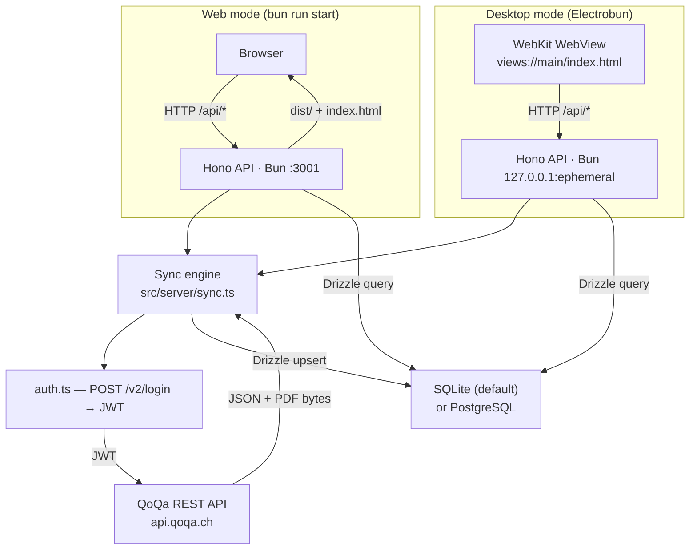

# Architecture

## Overview

QoQa Compta ships in two modes that share the same Hono API and React SPA:

- **Web mode** — a Hono server on Bun serves the REST API and the compiled Vite SPA from `dist/`. Runs in any browser; no native shell required.
- **Desktop mode** — [Electrobun](https://github.com/blackboardsh/electrobun) wraps the same Hono server and renders the SPA in a native WebKit WebView. The resulting `.app` / `.exe` bundle is a self-contained executable.

### Technology stack

| Component | Role |
|---|---|
| **[Bun](https://bun.sh)** | JavaScript runtime (replaces Node.js) and package manager. All server-side code runs on Bun; `bun --watch` provides hot-reload in development. |
| **[Vite](https://vitejs.dev)** | Dev server (`:3000`) and production bundler for the React SPA. In development it proxies `/api/*` to Hono on `:3001`. |
| **[Hono](https://hono.dev/)** | Lightweight web framework for the REST API. Handles routing, CORS, request logging, and SSE. Shared between web and desktop modes via `src/server/app.ts`. |
| **[Electrobun](https://github.com/blackboardsh/electrobun)** | Desktop container built on Bun + WebKit. Provides a native `BrowserWindow`, a `views://` custom protocol to serve the SPA, a native application menu, and OS utilities (file dialogs, etc.). The Hono server starts inside the same process, bound to `127.0.0.1` on an ephemeral port the OS assigns at startup, which the preload injects into the SPA as `window.__API_PORT__` so several Electrobun apps can run side by side. Electrobun 2 builds through **Hutch**, its own native CLI: the `electrobun` npm package is only a bootstrap that downloads Hutch, which in turn generates the `.hutch/devkit/` SDK projection that `electrobun/main` imports resolve against. |
| **[Drizzle ORM](https://orm.drizzle.team)** | Type-safe ORM for all database access. Supports SQLite (default, no setup) and PostgreSQL (remote). |
| **[React 19](https://react.dev)** | SPA UI library with React Router v7 for client-side routing and Recharts for charts. |



In **web development** Vite's dev server runs on `:3000` and proxies `/api/*` to Hono on `:3001`; in **web production** Hono serves `dist/` and falls back to `index.html` for SPA routing.

In **desktop development** (`desktop:dev`), Electrobun probes the Vite dev server first and falls back to the bundled `views://` SPA if it is not running. All API calls in the SPA go through `src/views/lib/api-client.ts`, keeping the HTTP transport swappable.

---

## Scripts

All scripts are run with `bun run <name>`.

| Script | Command | Purpose |
|---|---|---|
| `dev` | `concurrently vite + bun --watch src/server/index.ts` | Start both Vite dev server (`:3000`) and Hono API (`:3001`) with hot-reload. The standard entry point for web development. |
| `dev:vite` | `vite` | Start only the Vite dev server. Useful when the API is already running separately. |
| `dev:server` | `bun --watch src/server/index.ts` | Start only the Hono API server with hot-reload. |
| `desktop:prepare` | `bunx electrobun prepare` | Download Hutch and the pinned Electrobun core, and generate `.hutch/devkit/`. Needed once after cloning before `typecheck` or editor type resolution work; `desktop:dev` and `build:stable` do it implicitly. |
| `desktop:dev` | `bunx electrobun dev --watch` | Launch the app in Electrobun desktop dev mode with live-reload. Probes the Vite dev server (`:3000`) and uses it if running, otherwise serves the bundled SPA. |
| `build` | `vite build` | Compile the React SPA to `dist/`. Used both for web production and as the `preBuild` step for desktop releases. |
| `build:stable` | `bunx electrobun build --env=stable` | Build a production desktop bundle (`.app` on macOS, `.exe` on Windows). Runs `scripts/prebuild.ts` (`vite build`) first, then packages everything with Hutch, and finally runs `scripts/postwrap.ts` (ad-hoc code-signing on macOS). Hutch runs both hooks with Cottontail rather than Bun, so they shell out instead of importing from `bun`. |
| `start` | `NODE_ENV=production bun src/server/index.ts` | Start the Hono server in web production mode. Serves the pre-built SPA from `dist/` in addition to the API. Run `build` first. |
| `lint` | `eslint src --ext .ts,.tsx` | Lint all TypeScript source files. |
| `typecheck` | `bunx electrobun prepare && tsc --noEmit` | Type-check the whole project without emitting output. Prepares the devkit first, because `tsconfig.json` maps the `electrobun` and `electrobun/main` specifiers into `.hutch/devkit/`. |
| `db:push` | `drizzle-kit push` | Push the Drizzle schema to the database (creates or alters tables). |

---

## Project structure

```
qoqa-compta/
├── .gitignore
├── renovate.json
├── README.md
├── AGENTS.md                     # Instructions for coding agents
├── CLAUDE.md                     # Points Claude Code at AGENTS.md
├── index.html                    # Vite SPA entry
├── vite.config.ts
├── tsconfig.json
├── drizzle.config.ts
├── electrobun.config.ts          # Electrobun build config (app name, icons, entry, hooks)
├── hutch.config.ts               # Hutch workspace config — keeps Bun as the package manager
├── docs/
│   ├── architecture.md           # this file
│   └── universe-filters.md       # how the universe/sub-universe filter behaves
├── scripts/
│   ├── prebuild.ts               # Runs `vite build` before Electrobun packages the app
│   └── postwrap.ts               # Ad-hoc code-signs the .app bundle on macOS after wrapping
└── src/
    ├── electrobun/
    │   ├── index.ts              # Desktop entry — starts Hono, opens BrowserWindow, installs the menu
    │   └── menu.ts               # Application menu — macOS only
    ├── server/                   # Hono API + sync engine (Bun)
    │   ├── index.ts              # Web entry point — mounts routes, bootstraps DB, serves dist/
    │   ├── app.ts                # Hono app factory (shared by web and desktop entry points)
    │   ├── auth.ts               # POST /v2/login → Bearer token
    │   ├── api.ts                # QoQa REST API client (universes, purchases, PDFs)
    │   ├── sync.ts               # Full / incremental sync pipeline (SSE progress)
    │   ├── sync-job.ts           # Running-job state (abort controller, status)
    │   ├── db.ts                 # Drizzle ORM client — SQLite or PostgreSQL
    │   ├── schema.ts             # Drizzle table definitions (dual SQLite + PG)
    │   ├── schema-bootstrap.ts   # CREATE TABLE IF NOT EXISTS bootstrap
    │   ├── queries.ts            # All DB operations (upsert, select, aggregate)
    │   ├── settings.ts           # settings.json read/write (platform-aware path)
    │   ├── install.ts            # How the running copy was installed (brew, scoop, manual, web)
    │   └── routes/
    │       ├── app.ts            # GET /api/app/latest-release, GET /api/app/install
    │       ├── dashboard.ts      # GET /api/dashboard
    │       ├── orders.ts         # GET /api/orders, GET /api/orders/:n/pdf, GET /api/orders/csv
    │       ├── sync.ts           # POST /api/sync, DELETE /api/sync, GET /api/sync/stream (SSE)
    │       └── settings.ts       # GET/PUT /api/settings, DELETE /api/settings/database
    ├── views/                    # Vite SPA (React 19)
    │   ├── main.tsx              # React entry point
    │   ├── globals.css           # Tailwind v4 + CSS variable theming
    │   ├── pages/
    │   │   └── DashboardPage.tsx # Main dashboard page
    │   ├── components/
    │   │   ├── ui/               # Base UI primitives (button, input, card, badge)
    │   │   ├── universe-picker.tsx    # Hierarchical universe+subuniverse filter
    │   │   ├── orders-table.tsx       # Searchable, paginated orders table
    │   │   ├── order-pdf-dialog.tsx   # Invoice PDF popup (Base UI Dialog + iframe)
    │   │   ├── spending-chart.tsx     # Monthly + yearly Recharts ComposedChart
    │   │   ├── spending-pie-chart.tsx # Spending breakdown by universe/subuniverse
    │   │   ├── stats-cards.tsx        # Aggregate stat cards
    │   │   ├── date-range-picker.tsx  # Date range filter
    │   │   ├── settings-modal.tsx     # Settings + sync control modal
    │   │   ├── about-modal.tsx        # Version, update status and project links
    │   │   ├── theme-provider.tsx
    │   │   └── theme-toggle.tsx
    │   ├── i18n/
    │   │   ├── index.ts          # react-i18next setup + locale detection
    │   │   └── messages/         # en.json, fr.json, de.json, it.json, rm.json
    │   └── lib/
    │       ├── api-client.ts     # All fetch calls — single place to swap transport
    │       ├── about-event.ts    # Name of the window event the menu dispatches to open About
    │       ├── clipboard.ts      # Copy helper with an execCommand fallback for the WebView
    │       ├── desktop.ts        # Flags injected by the Electrobun preload (title bar)
    │       ├── formatter-context.tsx  # React context for fr-CH number/date formatters
    │       ├── formatters.ts     # formatCHF, formatDate, formatMonth
    │       ├── use-filter-state.ts    # Persisted universe/date filter state (localStorage)
    │       ├── use-install-info.ts    # Install method, fetched once per app load
    │       ├── use-latest-release.ts  # Shared release-check store, compared to the built version
    │       └── utils.ts          # cn() and other utilities
    └── shared/
        ├── filters.ts            # Universe selection model — see universe-filters.md
        └── types.ts              # Shared TypeScript types (QoqaOrder, AppSettings, …)
```

---

## Desktop shell

### Application menu

Only macOS gets one. `installApplicationMenu` returns without calling `ApplicationMenu.setApplicationMenu` on any other platform, so the Windows window has no menu bar and nothing to toggle. Electrobun's Windows menu builder implements `quit`, the edit roles and `close`/`minimize`/`zoom`, and implements none of `about`, `hide`, `hideOthers`, `showAll` or `bringAllToFront` — what it can build there is a short row of duplicates of things the WebView and the window frame already do, and the one item worth having, About, is not among them.

Nothing is lost: the editing shortcuts work natively in the WebView, Alt+F4 and the window controls close the window, and About sits behind the version number in the header.

The macOS menu is permanently visible. Its About item carries an `action` rather than the `about` role, and the main process answers it by dispatching a `qoqa:show-about` event into the WebView, which opens the same dialog the header version number opens.

### Update check

`GET /api/app/latest-release` reads the GitHub releases API server-side, because the opaque `views://` origin cannot satisfy CORS. Results are cached in memory for 6h on success and 15m on failure; `?refresh=1` bypasses the cache, which is what the **Check now** button in the About dialog calls. The response carries the timestamp of the check, shown as *last checked*. The SPA checks once per load — one shared store feeds both the header badge and the dialog — and marks the header version number when the published version is newer.

Nothing self-updates: Electrobun's `Updater` writes to `%LOCALAPPDATA%\<identifier>\<channel>\app` on Windows regardless of where the running copy lives, which would fork a Scoop install into a second copy, and on macOS it would overwrite an app Homebrew believes it manages. The About dialog names the right update command instead, picked from `GET /api/app/install`: a path under `scoop\apps` means Scoop, a `Caskroom/qoqa-compta` entry under the Homebrew prefix means Homebrew, a browser means neither, and anything else is treated as a manual install and offered a download link. Both signals are heuristics that fall back to *manual*, never to a wrong command.

### Network binding

Both entry points bind the API to loopback — the desktop one to `127.0.0.1` always, the web one to `$HOST` defaulting to `127.0.0.1`. A wildcard bind makes Windows raise a Defender Firewall prompt on first run. Electrobun's own transport is loopback too: its core parses `127.0.0.1` for the webview RPC websocket.

### Window state

The window is created hidden at its saved frame and maximized on restore. On Windows the maximize happens after `show()`, so it reaches a window whose WebView2 controller already exists; on macOS it happens before, which is what keeps the maximize animation off screen.

---

## Sync pipeline

The sync runs inside the Hono server process as an async task managed by `src/server/sync-job.ts`. Progress is streamed to the client via Server-Sent Events (`GET /api/sync/stream`).

```
POST /api/sync { mode: "full" | "update" }
  → auth.ts          — POST auth.qoqa.ch/v2/login → JWT
  → api.ts           — fetchUniverses + sub-universes → upsert to qoqa_universes / qoqa_subuniverses
  → api.ts           — fetchPurchases (paginated list)
  → for each order:
      api.ts         — fetchOrderDetail → extract fields
      api.ts         — downloadPdf → pdf_data bytes
      queries.ts     — upsertOrder (INSERT … ON CONFLICT DO UPDATE) + replace its sub-universe tags
  → SSE stream emits typed SyncProgressEvent at each step
```

In **update** mode, sync stops after 5 consecutive already-known orders to avoid full re-scans.

---

## Settings

User settings are persisted to a platform-aware JSON file:

| Platform | Path |
|---|---|
| macOS | `~/Library/Application Support/QoQa Compta/settings.json` |
| Windows | `%APPDATA%\QoQa Compta\settings.json` |
| Linux | `$XDG_CONFIG_HOME/qoqa-compta/settings.json` (or `~/.config/…`) |

macOS and Windows name the folder after the app as the user sees it; the XDG spec wants a lowercase, machine-readable name. Both used to be `qoqa-compta`: on macOS and Windows a directory left behind by an earlier version is moved across on first launch (see `src/server/paths.ts`). If the move fails the old location keeps being used, so data is never lost.

In **development** only, env vars (`QOQA_EMAIL`, `QOQA_PASSWORD`, `DATABASE_URL`) take precedence over the file.

---

## Database

SQLite is the default (no setup needed). PostgreSQL is supported for remote/shared setups.

### SQLite

The database file defaults to:

| Platform | Path |
|---|---|
| macOS | `~/Library/Application Support/QoQa Compta/qoqa.db` |
| Windows | `%APPDATA%\QoQa Compta\qoqa.db` |
| Linux | `$XDG_DATA_HOME/qoqa-compta/qoqa.db` |

The same first-launch migration described under [Settings](#settings) applies here; on macOS and Windows both files live in one directory, so a single rename carries them across together.

### PostgreSQL

Set `DATABASE_URL` to a `postgresql://…` connection string in the Settings modal (or `.env` in dev).

### Table structure

```sql
-- Orders — one row per QoQa order; pdf_data stores the raw invoice PDF bytes
CREATE TABLE qoqa_orders (
    id               INTEGER PRIMARY KEY AUTOINCREMENT,  -- SERIAL on PG
    order_number     TEXT UNIQUE NOT NULL,
    order_date       TEXT NOT NULL,
    amount_chf       NUMERIC(10, 2) NOT NULL,
    status           TEXT,
    subtotal_chf     NUMERIC(10, 2),
    discount_chf     NUMERIC(10, 2),
    vat_chf          NUMERIC(10, 2),
    delivery_on      TEXT,
    offer_id         TEXT,
    offer_title      TEXT,
    offer_subtitle   TEXT,
    universe         TEXT,          -- universe_tracking_identifier (FK → qoqa_universes)
    subuniverse      TEXT,          -- primary cleaned identifier (FK → qoqa_subuniverses)
    item_description TEXT,
    invoice_number   TEXT,
    pdf_filename     TEXT,
    pdf_data         BLOB,          -- BYTEA on PostgreSQL
    raw_json         TEXT,
    created_at       TEXT NOT NULL DEFAULT (datetime('now')),
    updated_at       TEXT NOT NULL DEFAULT (datetime('now'))
);

-- Universe lookup — populated from /v2/alerts API on every sync
CREATE TABLE qoqa_universes (
    id                           INTEGER PRIMARY KEY AUTOINCREMENT,
    universe_tracking_identifier TEXT UNIQUE NOT NULL,
    name_fr                      TEXT,
    name_de                      TEXT,
    updated_at                   TEXT NOT NULL DEFAULT (datetime('now'))
);

-- Sub-universe lookup — extracted from push_topics of each universe
CREATE TABLE qoqa_subuniverses (
    id                           INTEGER PRIMARY KEY AUTOINCREMENT,
    identifier                   TEXT UNIQUE NOT NULL,
    name_fr                      TEXT,
    name_de                      TEXT,
    universe_tracking_identifier TEXT NOT NULL,  -- FK → qoqa_universes
    updated_at                   TEXT NOT NULL DEFAULT (datetime('now'))
);

-- Every sub-universe tag an order carries, primary at position 0
CREATE TABLE qoqa_order_subuniverses (
    id           INTEGER PRIMARY KEY AUTOINCREMENT,
    order_number TEXT NOT NULL,     -- FK → qoqa_orders.order_number
    subuniverse  TEXT NOT NULL,     -- cleaned identifier (FK → qoqa_subuniverses)
    position     INTEGER NOT NULL,  -- order the QoQa API returned the tags in
    UNIQUE (order_number, subuniverse)
);
```

### Multiple sub-universes per order

A QoQa offer can carry several sub-universe tags — a tawny port is filed under both `wine` and `spirits` — with no primary marker in the API. The first tag of the array is treated as the primary and stays on `qoqa_orders.subuniverse`; `qoqa_order_subuniverses` holds the full list.

The two are used for different things. **Filtering and the filter tree** address the full list, so picking *Spiritueux* also returns the port; the condition is an `EXISTS` subquery, so an order matching several selected tags is still counted once. **Money grouping** (the sub-universe pie) stays on the primary tag: the order has one item and one amount, so its CHF lands in exactly one slice and the pie keeps summing to the total on the stats card. A consequence worth knowing: under a single-tag filter the pie can show a slice for another sub-universe, because a matched order is grouped under its own primary.

Databases synced before this table existed are filled in at startup from `raw_json`, which already carries the tag arrays — see `backfillOrderSubuniverses()` in `src/server/queries.ts`. No re-sync is required.

How the picker turns a user's choice into those filters — the three selection states, how a stale selection is repaired, and what the button label counts — is documented separately in [universe-filters.md](universe-filters.md).

### Invoice PDFs

Each row in `qoqa_orders` carries the raw invoice PDF in the `pdf_data` column. List queries never select `pdf_data`; instead they project a `has_pdf` boolean (`pdf_data IS NOT NULL`) to keep the orders endpoint cheap. PDFs are served via `GET /api/orders/:orderNumber/pdf`.

