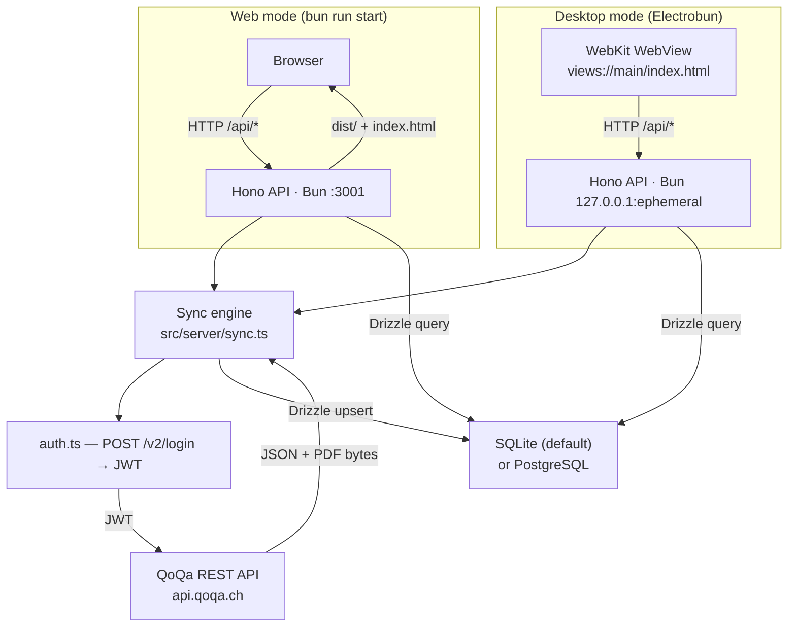

# Architecture

## Overview

QoQa Compta ships in two modes that share the same Hono API and React SPA:

- **Web mode** — a Hono server on Bun serves the REST API and the compiled Vite SPA from `dist/`. Runs in any browser; no native shell required.
- **Desktop mode** — [Electrobun](https://github.com/blackboardsh/electrobun) wraps the same Hono server and renders the SPA in a native WebKit WebView. The resulting `.app` / `.exe` bundle is a self-contained executable.

### Technology stack

| Component | Role |
|---|---|
| **[Bun](https://bun.sh)** | JavaScript runtime (replaces Node.js) and package manager. All server-side code runs on Bun; `bun --watch` provides hot-reload in development. |
| **[Vite](https://vitejs.dev)** | Dev server (`:3000`) and production bundler for the React SPA. In development it proxies `/api/*` to Hono on `:3001`. |
| **[Hono](https://hono.dev/)** | Lightweight web framework for the REST API. Handles routing, CORS, request logging, and SSE. Shared between web and desktop modes via `src/server/app.ts`. |
| **[Electrobun](https://github.com/blackboardsh/electrobun)** | Desktop container built on Bun + WebKit. Provides a native `BrowserWindow`, a `views://` custom protocol to serve the SPA, a native application menu, and OS utilities (file dialogs, etc.). The Hono server starts inside the same process, bound to `127.0.0.1` on an ephemeral port the OS assigns at startup, which the preload injects into the SPA as `window.__API_PORT__` so several Electrobun apps can run side by side. Electrobun 2 builds through **Hutch**, its own native CLI: the `electrobun` npm package is only a bootstrap that downloads Hutch, which in turn generates the `.hutch/devkit/` SDK projection that `electrobun/main` imports resolve against. |
| **[Drizzle ORM](https://orm.drizzle.team)** | Type-safe ORM for all database access. Supports SQLite (default, no setup) and PostgreSQL (remote). |
| **[React 19](https://react.dev)** | SPA UI library with React Router v7 for client-side routing and Recharts for charts. |



In **web development** Vite's dev server runs on `:3000` and proxies `/api/*` to Hono on `:3001`; in **web production** Hono serves `dist/` and falls back to `index.html` for SPA routing.

In **desktop development** (`desktop:dev`), Electrobun probes the Vite dev server first and falls back to the bundled `views://` SPA if it is not running. All API calls in the SPA go through `src/views/lib/api-client.ts`, keeping the HTTP transport swappable.

---

## Scripts

All scripts are run with `bun run <name>`.

| Script | Command | Purpose |
|---|---|---|
| `dev` | `concurrently vite + bun --watch src/server/index.ts` | Start both Vite dev server (`:3000`) and Hono API (`:3001`) with hot-reload. The standard entry point for web development. |
| `dev:vite` | `vite` | Start only the Vite dev server. Useful when the API is already running separately. |
| `dev:server` | `bun --watch src/server/index.ts` | Start only the Hono API server with hot-reload. |
| `desktop:prepare` | `bunx electrobun prepare` | Download Hutch and the pinned Electrobun core, and generate `.hutch/devkit/`. Needed once after cloning before `typecheck` or editor type resolution work; `desktop:dev` and `build:stable` do it implicitly. |
| `desktop:dev` | `bunx electrobun dev --watch` | Launch the app in Electrobun desktop dev mode with live-reload. Probes the Vite dev server (`:3000`) and uses it if running, otherwise serves the bundled SPA. |
| `build` | `vite build` | Compile the React SPA to `dist/`. Used both for web production and as the `preBuild` step for desktop releases. |
| `build:stable` | `bunx electrobun build --env=stable` | Build a production desktop bundle (`.app` on macOS, `.exe` on Windows). Runs `scripts/prebuild.ts` (`vite build`) first, then packages everything with Hutch, and finally runs `scripts/postwrap.ts` (installer-panel `LSEnvironment` stamp and ad-hoc code-signing on macOS). Hutch runs both hooks with Cottontail rather than Bun, so they shell out instead of importing from `bun`. |
| `start` | `NODE_ENV=production bun src/server/index.ts` | Start the Hono server in web production mode. Serves the pre-built SPA from `dist/` in addition to the API. Run `build` first. |
| `lint` | `eslint src --ext .ts,.tsx` | Lint all TypeScript source files. |
| `typecheck` | `bunx electrobun prepare && tsc --build` | Type-check every runtime without emitting output. `tsconfig.json` is a solution file that only references the per-runtime projects, so `--build` checks each of them against its own globals. Prepares the devkit first, because `tsconfig.electrobun.json` and `tsconfig.tools.json` map the `electrobun` specifiers into `.hutch/devkit/`. Each project drops a gitignored `tsconfig.*.tsbuildinfo` at the repo root for incremental reruns. |
| `db:generate` | `db:generate:sqlite && db:generate:pg && db:embed` | Regenerate the migrations for both dialects from `src/server/schema.ts`, then re-embed them. The only command needed after changing the schema. Needs no database and no `DATABASE_URL` — `drizzle-kit generate` diffs `schema.ts` against the snapshots in `drizzle/*/meta/` entirely offline. |
| `db:generate:sqlite` | `drizzle-kit generate --config=drizzle.config.sqlite.ts` | Write the SQLite migration into `drizzle/sqlite/`. Drizzle Kit picks the `sqliteTable` definitions out of the shared `schema.ts` and ignores the `pgTable` ones. |
| `db:generate:pg` | `drizzle-kit generate --config=drizzle.config.pg.ts` | The same for PostgreSQL, into `drizzle/pg/`. |
| `db:embed` | `bun scripts/embed-migrations.ts` | Regenerate `src/server/migrations.generated.ts` from the two journals, inlining each migration's SQL as a string constant so it is compiled into the bundle. |
| `db:verify` | `bun scripts/embed-migrations.ts --check` | Fail if that generated file is stale. `bun test` asserts the same invariant, so CI catches a forgotten `db:embed` without a separate step. |

---

## Project structure

```
qoqa-compta/
├── .gitattributes                # Pins LF in the working tree — the embedded migrations are compared byte for byte
├── .gitignore
├── renovate.json
├── README.md
├── AGENTS.md                     # Instructions for coding agents
├── CLAUDE.md                     # Points Claude Code at AGENTS.md
├── index.html                    # Vite SPA entry
├── vite.config.ts
├── tsconfig.json                 # Solution file — references the five per-runtime projects below
├── tsconfig.base.json            # Options shared by all of them: strictness flags, lib ES2022 only, types []
├── tsconfig.shared.json          # src/shared/ — no DOM, no Bun
├── tsconfig.server.json          # src/server/ — Bun types, no DOM
├── tsconfig.views.json           # src/views/ — DOM, no Bun, @/* alias
├── tsconfig.electrobun.json      # src/electrobun/ — Bun types + the electrobun specifier mappings
├── tsconfig.tools.json           # vite/electrobun/hutch configs and scripts/ — Bun types
├── drizzle.config.sqlite.ts      # Drizzle Kit — SQLite migrations into drizzle/sqlite/
├── drizzle.config.pg.ts          # Drizzle Kit — PostgreSQL migrations into drizzle/pg/
├── drizzle/                      # Generated migrations, committed and shipped
│   ├── sqlite/                   # 0000_initial_schema.sql + meta/_journal.json
│   └── pg/                       # same, for PostgreSQL
├── electrobun.config.ts          # Electrobun build config (app name, icons, entry, hooks)
├── hutch.config.ts               # Hutch workspace config — keeps Bun as the package manager
├── docs/
│   ├── architecture.md           # this file
│   └── universe-filters.md       # how the universe/sub-universe filter behaves
├── scripts/
│   ├── prebuild.ts               # Runs `vite build` before Electrobun packages the app
│   ├── embed-migrations.ts       # Regenerates src/server/migrations.generated.ts from drizzle/
│   └── postwrap.ts               # Stamps LSEnvironment and ad-hoc code-signs the macOS .app after wrapping
└── src/
    ├── electrobun/
    │   ├── index.ts              # Desktop entry — starts Hono, opens BrowserWindow, installs the menu
    │   └── menu.ts               # Application menu — macOS only
    ├── server/                   # Hono API + sync engine (Bun)
    │   ├── index.ts              # Web entry point — mounts routes, migrates DB, serves dist/
    │   ├── app.ts                # Hono app factory (shared by web and desktop entry points)
    │   ├── auth.ts               # POST /v2/login → Bearer token
    │   ├── api.ts                # QoQa REST API client (universes, purchases, PDFs)
    │   ├── sync.ts               # Full / incremental sync pipeline (SSE progress)
    │   ├── sync-job.ts           # Running-job state (abort controller, status)
    │   ├── db.ts                 # Drizzle ORM client — SQLite or PostgreSQL
    │   ├── schema.ts             # Drizzle table definitions (dual SQLite + PG)
    │   ├── migrate.ts            # Applies the Drizzle migrations at startup; baselines pre-migrations databases
    │   ├── migrations.generated.ts # Generated — migration SQL inlined so it ships in the bundle
    │   ├── queries.ts            # All DB operations (upsert, select, aggregate)
    │   ├── settings.ts           # settings.json read/write (platform-aware path)
    │   ├── secrets.ts            # QoQa password + PostgreSQL URL in the OS credential store, with a settings.json fallback
    │   ├── environment.ts        # Whether env vars may override stored settings — always in dev, web mode only in production
    │   ├── database-url.ts       # Masks the password inside a connection string for the SPA, and restores it on save
    │   ├── install.ts            # How the running copy was installed (brew, scoop, manual, web)
    │   └── routes/
    │       ├── app.ts            # GET /api/app/latest-release, GET /api/app/install, POST /api/app/open-external
    │       ├── dashboard.ts      # GET /api/dashboard
    │       ├── orders.ts         # GET /api/orders, GET /api/orders/:n/pdf, GET /api/orders/csv
    │       ├── sync.ts           # POST /api/sync, DELETE /api/sync, GET /api/sync/stream (SSE)
    │       └── settings.ts       # GET/PUT /api/settings, POST /api/settings/test-credentials, DELETE /api/settings/database, DELETE /api/settings/database/file, GET /api/settings/credential-store
    ├── views/                    # Vite SPA (React 19)
    │   ├── main.tsx              # React entry point
    │   ├── globals.css           # Tailwind v4 + CSS variable theming
    │   ├── pages/
    │   │   └── DashboardPage.tsx # Main dashboard page
    │   ├── components/
    │   │   ├── ui/               # Base UI primitives (button, input, card, badge)
    │   │   ├── universe-picker.tsx    # Hierarchical universe+subuniverse filter
    │   │   ├── orders-table.tsx       # Searchable, paginated orders table
    │   │   ├── order-pdf-dialog.tsx   # Invoice PDF popup (Base UI Dialog + iframe)
    │   │   ├── spending-chart.tsx     # Monthly + yearly Recharts ComposedChart
    │   │   ├── spending-pie-chart.tsx # Spending breakdown by universe/subuniverse
    │   │   ├── stats-cards.tsx        # Aggregate stat cards
    │   │   ├── date-range-picker.tsx  # Date range filter
    │   │   ├── settings-modal.tsx     # Settings + sync control modal
    │   │   ├── about-modal.tsx        # Version, update status and project links
    │   │   ├── theme-provider.tsx
    │   │   └── theme-toggle.tsx
    │   ├── i18n/
    │   │   ├── index.ts          # react-i18next setup + locale detection
    │   │   └── messages/         # en.json, fr.json, de.json, it.json, rm.json
    │   └── lib/
    │       ├── api-client.ts     # All fetch calls — single place to swap transport
    │       ├── about-event.ts    # Name of the window event the menu dispatches to open About
    │       ├── clipboard.ts      # Copy helper with an execCommand fallback for the WebView
    │       ├── desktop.ts        # Flags injected by the Electrobun preload (title bar)
    │       ├── formatter-context.tsx  # React context for fr-CH number/date formatters
    │       ├── formatters.ts     # formatCHF, formatDate, formatMonth
    │       ├── use-filter-state.ts    # Persisted universe/date filter state (localStorage)
    │       ├── use-install-info.ts    # Install method, fetched once per app load
    │       ├── use-latest-release.ts  # Shared release-check store, compared to the built version
    │       └── utils.ts          # cn() and other utilities
    └── shared/
        ├── filters.ts            # Universe selection model — see universe-filters.md
        └── types.ts              # Shared TypeScript types (QoqaOrder, AppSettings, …)
```

### Compiler strictness

`tsconfig.base.json` turns on `strict` plus `noUncheckedIndexedAccess`, `noUnusedLocals`, `noUnusedParameters`, `verbatimModuleSyntax`, `noImplicitOverride` and `erasableSyntaxOnly`, so every project inherits them.

`noUnusedLocals` and `noUnusedParameters` carry weight that their zero error count hides. typescript-eslint cannot load against `typescript@7` — TS 7 ships only `./lib/version.cjs` and exposes no compiler API — so `no-unused-vars` is unavailable and the compiler is the only thing in the repo that catches a dead import, local or parameter. `erasableSyntaxOnly` matches how the code actually runs: Bun strips types and Vite does the same through esbuild, and neither performs the code generation an `enum` or a constructor parameter property needs.

`exactOptionalPropertyTypes` is deliberately **off**. Enabled across the solution it reports 32 sites, 15 of them inside `.hutch/devkit` — vendored Electrobun SDK sources, which are `.ts` rather than `.d.ts`, so `skipLibCheck` does not cover them, and which are gitignored and re-materialized from a lockfile on every clean checkout, so they cannot be patched in-repo. Scoping the flag to the four projects that never import the devkit still leaves 18 sites in `src/`, and all 18 are the same shape: an object literal built with `from: string | undefined` handed to a `from?: string` parameter. None is a latent bug — those values flow into `URLSearchParams` builders, JSON responses and JSX prop spreads, where an absent key and an explicit `undefined` are indistinguishable. Clearing them means either widening every declaration to `from?: string | undefined`, which neuters the flag, or rewriting each construction site as a conditional spread. Both cost readability and neither buys a caught defect.

`skipLibCheck` stays on for the same devkit reason.

---

## Desktop shell

### Application menu

Only macOS gets one. `installApplicationMenu` returns without calling `ApplicationMenu.setApplicationMenu` on any other platform, so the Windows window has no menu bar and nothing to toggle. Electrobun's Windows menu builder implements `quit`, the edit roles and `close`/`minimize`/`zoom`, and implements none of `about`, `hide`, `hideOthers`, `showAll` or `bringAllToFront` — what it can build there is a short row of duplicates of things the WebView and the window frame already do, and the one item worth having, About, is not among them.

Nothing is lost: the editing shortcuts work natively in the WebView, Alt+F4 and the window controls close the window, and About sits behind the version number in the header.

The macOS menu is permanently visible. Its About item carries an `action` rather than the `about` role, and the main process answers it by dispatching a `qoqa:show-about` event into the WebView, which opens the same dialog the header version number opens.

### Update check

`GET /api/app/latest-release` reads the GitHub releases API server-side, because the opaque `views://` origin cannot satisfy CORS. Results are cached in memory for 6h on success and 15m on failure; `?refresh=1` bypasses the cache, which is what the **Check now** button in the About dialog calls. The response carries the timestamp of the check, shown as *last checked*. The SPA checks once per load — one shared store feeds both the header badge and the dialog — and marks the header version number when the published version is newer.

Nothing self-updates: Electrobun's `Updater` writes to `%LOCALAPPDATA%\<identifier>\<channel>\app` on Windows regardless of where the running copy lives, which would fork a Scoop install into a second copy, and on macOS it would overwrite an app Homebrew believes it manages. The About dialog names the right update command instead, picked from `GET /api/app/install`: a path under `scoop\apps` means Scoop, a `Caskroom/qoqa-compta` entry under the Homebrew prefix means Homebrew, a browser means neither, and anything else is treated as a manual install and offered a download link. Both signals are heuristics that fall back to *manual*, never to a wrong command.

### macOS installer panel

The macOS DMG does not contain the app: it contains a self-extracting wrapper `.app` whose executable is Electrobun's `extractor` and whose payload is the real app, zstd-compressed, in the same bundle at `Contents/Resources/<hash>.tar.zst`. Nothing is downloaded on first launch — the extractor unpacks that local payload over its own bundle, so the copy in `/Applications` turns into the real app, and leaves the retained tar, an `uninstall` binary and `.electrobun-uninstall.json` under `~/Library/Application Support/io.github.nyg.qoqa-compta/stable/`. It happens once per install. Electrobun 2 draws a native progress panel while it unpacks, then parks it in a terminal *Installation complete* state waiting for a **Close** click the user never sees, because the app window has already opened on top of it.

`scripts/postwrap.ts` stamps `LSEnvironment` into the wrapper's `Info.plist` with `ELECTROBUN_INSTALLER_UI_AUTOCLOSE=1`, the only lever the extractor honours, so the panel dismisses itself. LaunchServices passes the variable on every normal launch; it does not reach the extractor when the inner binary is run straight from a shell. Windows keeps its installer UI — there the progress dialog is the whole install experience — and neither platform has a build-config switch to turn the panel off.

### Network binding

Both entry points bind the API to loopback — the desktop one to `127.0.0.1` always, the web one to `$HOST` defaulting to `127.0.0.1`. A wildcard bind makes Windows raise a Defender Firewall prompt on first run. Electrobun's own transport is loopback too: its core parses `127.0.0.1` for the webview RPC websocket.

### Window state

The window is created hidden at its saved frame and maximized on restore. On Windows the maximize happens after `show()`, so it reaches a window whose WebView2 controller already exists; on macOS it happens before, which is what keeps the maximize animation off screen.

---

## Sync pipeline

The sync runs inside the Hono server process as an async task managed by `src/server/sync-job.ts`. Progress is streamed to the client via Server-Sent Events (`GET /api/sync/stream`).

```
POST /api/sync { mode: "full" | "update" }
  → migrate.ts       — runMigrations() → emits db_ready with the migrations it applied
  → auth.ts          — POST auth.qoqa.ch/v2/login → JWT
  → api.ts           — fetchUniverses + sub-universes → upsert to qoqa_universes / qoqa_subuniverses
  → api.ts           — fetchPurchases (paginated list)
  → for each order:
      api.ts         — fetchOrderDetail → extract fields
      api.ts         — downloadPdf → pdf_data bytes
      queries.ts     — upsertOrder (INSERT … ON CONFLICT DO UPDATE) + replace its sub-universe tags
  → SSE stream emits typed SyncProgressEvent at each step
```

In **update** mode, sync stops after 5 consecutive already-known orders to avoid full re-scans.

The schema step comes first because saving a database URL no longer creates anything — see [Schema migrations](#schema-migrations). It is idempotent, so on every sync after the first it costs one journal read and emits *Database schema up to date*.

---

## Settings

User settings are persisted to a platform-aware JSON file:

| Platform | Path |
|---|---|
| macOS | `~/Library/Application Support/QoQa Compta/settings.json` |
| Windows | `%APPDATA%\QoQa Compta\settings.json` |
| Linux | `$XDG_CONFIG_HOME/qoqa-compta/settings.json` (or `~/.config/…`) |

macOS and Windows name the folder after the app as the user sees it; the XDG spec wants a lowercase, machine-readable name. Both used to be `qoqa-compta`: on macOS and Windows a directory left behind by an earlier version is moved across on first launch (see `src/server/paths.ts`). If the move fails the old location keeps being used, so data is never lost.

Env vars (`QOQA_EMAIL`, `QOQA_PASSWORD`, `DATABASE_URL`) take precedence over the file wherever `src/server/environment.ts` says they may: always in development, and in production only for the web entry point, which opts in by calling `allowEnvironmentOverrides()`. See [Web mode and headless hosts](#web-mode-and-headless-hosts).

### The secrets

Two settings do not live in `settings.json`: the QoQa password and the PostgreSQL connection string, both of which are credentials. They are stored in the OS credential store through `Bun.secrets`, under service `io.github.nyg.qoqa-compta` and names `qoqa-password` and `database-url`:

| Platform | Store |
|---|---|
| macOS | Keychain Services (login keychain) |
| Windows | Windows Credential Manager |
| Linux | libsecret (GNOME Keyring, KWallet) |

Electrobun has no credential API of its own — no equivalent of Electron's `safeStorage`. It bundles a Bun runtime (`build.mainProcess: "bun"`, currently Bun 1.4.0 per `.hutch/dependencies.lock`), and `Bun.secrets` is what that runtime offers. So the desktop app and `bun run start` reach the same store through the same code.

`src/server/secrets.ts` is the only module that reads or writes either of them. `readPassword()` / `writePassword()` and `readDatabaseUrl()` / `writeDatabaseUrl()` try the credential store first and fall back to a `qoqaPassword` or `databaseUrl` key in `settings.json` when it is unreachable — a headless Linux host without a secret service daemon, or a user who denies the macOS prompt — so the app never breaks, it only stops being able to protect the value. `migrateSecretsToCredentialStore()` runs at startup in both entry points, before `initDb()`, and moves either key written by an earlier version out of `settings.json`; if the store refuses the write it leaves the file alone rather than losing the value. `writeSettings()` spreads the raw file before the parsed settings for the same reason: a settings save that happens before the migration must not drop the keys.

On macOS the process that calls Security.framework is `Contents/MacOS/bun`, the stock Bun binary Electrobun copies into the bundle — byte-identical to an upstream Bun release and signed `Developer ID Application: Jarred Sumner (7FRXF46ZSN)`. The app's own ad-hoc signature (`scripts/postwrap.ts`) is not what the Keychain ACL binds to, which is why shipping a new app version does not re-prompt: our JavaScript changing does not change that binary's cdhash. Bumping the **bundled Bun version** does, so the release that carries one shows a single "wants to use your confidential information" prompt; the user clicks *Always Allow* once.

What this protects against is worth stating precisely. The keychain keeps these values out of a file that backups, cloud-synced config directories and any process reading the home directory can see. It does not isolate the app from other local code: because the code identity is the Bun binary rather than the app bundle, any `bun` script at the same version shares that identity and can read the item without a prompt ([oven-sh/bun#28071](https://github.com/oven-sh/bun/issues/28071)).

On Windows the same two calls land in Credential Manager as **generic** credentials, encrypted with the Data Protection API and persisted `CRED_PERSIST_ENTERPRISE`, so they are scoped to the Windows account and roam with an enterprise profile where one exists. Bun composes the target name as `service/name`, which makes them `io.github.nyg.qoqa-compta/qoqa-password` and `io.github.nyg.qoqa-compta/database-url`. Plain `cmdkey /list` does not enumerate them; `cmdkey /list:io.github.nyg.qoqa-compta/qoqa-password` shows the entry, and Control Panel → Credential Manager → Windows Credentials lists it.

The protection boundary is weaker than on macOS and it is worth being blunt about it: Windows shows no consent prompt and binds no per-application ACL, so **any** process running as the same user can read the value straight back. What is gained is the same thing macOS gains — the credential is not sitting in a JSON file that a backup, a synced profile directory or a stray `type settings.json` will expose — not isolation from other local code.

`GET /api/settings/credential-store` reports where each secret actually ended up — `keychain`, `credential-manager`, `keyring`, `file` (with the path) or `env` (with the variable name) — and the Settings modal prints it under the password field and under the database URL field, so the user can see whether a value is protected or sitting in a JSON file. The two are reported separately because they can genuinely differ: a store that refuses one write leaves that secret in the file while the other stays in the store.

The connection string reaches the SPA with only its password segment replaced by `*****` (`src/server/database-url.ts`), so the host stays readable for troubleshooting while the credential does not leave the server in the clear. `PUT /api/settings` puts the stored password back when the mask returns unedited, which also means the host can be corrected without retyping the password. A URL whose password is genuinely retyped is taken as-is, and a string that does not parse as a URL is passed through untouched in both directions.

### Web mode and headless hosts

`bun run start` uses the host's credential store exactly like the desktop app; on a developer's own Mac or Windows machine the two are indistinguishable. A container or a headless Linux server usually has no secret service daemon at all, so the store throws, `secrets.ts` warns once and falls back to `settings.json`, and the Settings modal says so per secret rather than implying a protection that is not there.

Because writing a password into a plaintext file is a poor answer for a server, `src/server/index.ts` calls `allowEnvironmentOverrides()` at startup, which lets `QOQA_EMAIL`, `QOQA_PASSWORD` and `DATABASE_URL` win over anything stored — in production as well as development. `GET /api/settings/credential-store` then reports `env` with the variable name, so the UI stays honest about where the value came from. `src/electrobun/index.ts` deliberately does **not** call it: a `DATABASE_URL` exported on a developer's machine belongs to whatever project they exported it for, and a desktop app that silently pointed itself at that database would be a bug. Outside development the desktop app therefore reads only the credential store and `settings.json`.

---

## Database

SQLite is the default (no setup needed). PostgreSQL is supported for remote/shared setups.

### SQLite

The database file defaults to:

| Platform | Path |
|---|---|
| macOS | `~/Library/Application Support/QoQa Compta/qoqa.db` |
| Windows | `%APPDATA%\QoQa Compta\qoqa.db` |
| Linux | `$XDG_DATA_HOME/qoqa-compta/qoqa.db` |

The same first-launch migration described under [Settings](#settings) applies here; on macOS and Windows both files live in one directory, so a single rename carries them across together.

### PostgreSQL

Set `DATABASE_URL` to a `postgresql://…` connection string in the Settings modal (or `.env` in dev).

Saving a URL neither creates nor touches a schema. `PUT /api/settings` runs `probeDatabaseUrl()` — a `SELECT 1` on a throwaway client — and rejects the save with a 400 when the server does not answer, so a typo leaves the working connection in place instead of writing itself into `settings.json` and then failing. Only once the probe passes is the URL stored and the live connection swapped.

Between that save and the first sync the target has no tables. `GET /api/dashboard` and `GET /api/orders` handle that by checking `isSchemaReady()` when a query fails and answering with an empty payload rather than a 500, which is what puts the SPA in its "no orders — run a sync" state. The check only runs on the failure path, so a working database never pays for it.

### Schema migrations

`src/server/schema.ts` is the single source of truth. It declares each table twice — once with `sqliteTable`, once with `pgTable` — because the two dialects differ in real ways (`BLOB` vs `BYTEA`, `AUTOINCREMENT` vs `GENERATED ALWAYS AS IDENTITY`). Nothing else restates the DDL.

Changing the schema is one edit plus one command:

```bash
# 1. edit src/server/schema.ts
bun run db:generate
# 2. commit drizzle/ and src/server/migrations.generated.ts alongside the schema change
```

`drizzle-kit generate` runs entirely offline — it diffs `schema.ts` against the snapshot in `drizzle/<dialect>/meta/` and writes the SQL. It never opens a database, so no `DATABASE_URL` is needed and no driver has to be installed. Each config selects its dialect, and Drizzle Kit picks only the matching table definitions out of the shared schema file.

`scripts/embed-migrations.ts` then regenerates `src/server/migrations.generated.ts`, which holds every migration's SQL as a string constant. The SQL is inlined rather than read from `drizzle/` at runtime, because the desktop app is a single compiled Bun bundle — a migrations directory that only exists in the repo would be missing at first run on a user's machine. `bun test` asserts the generated file still matches `drizzle/`, so a forgotten `db:generate` fails CI instead of shipping.

`src/server/migrate.ts` applies the migrations at two points: at startup in both entry points, and as the first step of every sync, where it emits a `db_ready` progress event naming the migrations it applied. Those are the only two, and neither is a settings save — creating tables in a remote database as a side effect of typing a URL into a form was the behaviour this replaced. `runMigrations()` returns what it did (`{ applied, baselined }`) so the sync log can say it, and it is idempotent, so the sync step is a journal read on every run after the first.

It replaced the old `bootstrapSchema()` and reuses Drizzle's own journal format — a `__drizzle_migrations` table holding the SHA-256 of each applied migration and its timestamp, in the `drizzle` schema on PostgreSQL — and the same "apply everything newer than the newest recorded timestamp" rule, so the journal stays readable by Drizzle's stock migrator. On SQLite it also runs `PRAGMA journal_mode=WAL` and `PRAGMA busy_timeout=5000`, which are connection settings rather than schema and so sit outside the migration transaction.

#### Baselining databases that predate migrations

Before migrations existed, the schema was created by `CREATE TABLE IF NOT EXISTS` statements at every startup. There were no `ALTER TABLE`s and no journal, so every database already in the wild has all four tables and no record of how it got them. Running migration `0000` against one of those would fail on the first bare `CREATE TABLE`, breaking startup for every existing install.

`runMigrations()` detects that case and records `0000` as applied without executing it:

> no rows in `__drizzle_migrations` **and** `qoqa_orders` already exists

Both halves matter. A genuinely fresh database has no journal *and* no tables, so it runs `0000` normally. A database that has been migrated before has journal rows, so it skips the check entirely. Only the pre-migrations shape satisfies both. The table probe is `sqlite_master` on SQLite and `to_regclass()` on PostgreSQL, the latter resolving through `search_path` exactly as the unqualified DDL does.

Because the baseline stamps `0000` with its real timestamp, everything after it applies by the ordinary rule. A database baselined this way and a database built from scratch by migrations converge on the identical journal, and every later migration lands on both.

Migration `0000` is the schema as it stood when migrations were introduced, which is exactly what `bootstrapSchema()` produced — that equivalence is what makes the baseline sound, and it holds permanently, because `0000` never changes.

#### Resetting

`dropAllTables()` drops the journal along with the four tables. The next `runMigrations()` therefore sees neither a journal nor a `qoqa_orders` table, takes the fresh path, and rebuilds from `0000`.

The Settings modal picks the destructive action that fits the database actually in use, because dropping tables is the only thing a remote PostgreSQL server allows and it is not what a user asking to delete a local database means. On PostgreSQL the button resets: `dropAllTables()` followed by `runMigrations()`, so the schema is back and empty. On SQLite it deletes: `deleteSqliteFile()` closes the handle, removes `qoqa.db` along with its `-wal` and `-shm` sidecars, and reopens the same path, leaving a file with no schema at all until the next sync creates one. Both leave the dashboard empty — `isSchemaReady()` is what keeps the API answering with empty results rather than errors in between.

### Table structure

```sql
-- Orders — one row per QoQa order; pdf_data stores the raw invoice PDF bytes
CREATE TABLE qoqa_orders (
    id               INTEGER PRIMARY KEY AUTOINCREMENT,  -- SERIAL on PG
    order_number     TEXT UNIQUE NOT NULL,
    order_date       TEXT NOT NULL,
    amount_chf       NUMERIC(10, 2) NOT NULL,
    status           TEXT,
    subtotal_chf     NUMERIC(10, 2),
    discount_chf     NUMERIC(10, 2),
    vat_chf          NUMERIC(10, 2),
    delivery_on      TEXT,
    offer_id         TEXT,
    offer_title      TEXT,
    offer_subtitle   TEXT,
    universe         TEXT,          -- universe_tracking_identifier (FK → qoqa_universes)
    subuniverse      TEXT,          -- primary cleaned identifier (FK → qoqa_subuniverses)
    item_description TEXT,
    invoice_number   TEXT,
    pdf_filename     TEXT,
    pdf_data         BLOB,          -- BYTEA on PostgreSQL
    raw_json         TEXT,
    created_at       TEXT NOT NULL DEFAULT (datetime('now')),
    updated_at       TEXT NOT NULL DEFAULT (datetime('now'))
);

-- Universe lookup — populated from /v2/alerts API on every sync
CREATE TABLE qoqa_universes (
    id                           INTEGER PRIMARY KEY AUTOINCREMENT,
    universe_tracking_identifier TEXT UNIQUE NOT NULL,
    name_fr                      TEXT,
    name_de                      TEXT,
    updated_at                   TEXT NOT NULL DEFAULT (datetime('now'))
);

-- Sub-universe lookup — extracted from push_topics of each universe
CREATE TABLE qoqa_subuniverses (
    id                           INTEGER PRIMARY KEY AUTOINCREMENT,
    identifier                   TEXT UNIQUE NOT NULL,
    name_fr                      TEXT,
    name_de                      TEXT,
    universe_tracking_identifier TEXT NOT NULL,  -- FK → qoqa_universes
    updated_at                   TEXT NOT NULL DEFAULT (datetime('now'))
);

-- Every sub-universe tag an order carries, primary at position 0
CREATE TABLE qoqa_order_subuniverses (
    id           INTEGER PRIMARY KEY AUTOINCREMENT,
    order_number TEXT NOT NULL,     -- FK → qoqa_orders.order_number
    subuniverse  TEXT NOT NULL,     -- cleaned identifier (FK → qoqa_subuniverses)
    position     INTEGER NOT NULL,  -- order the QoQa API returned the tags in
    UNIQUE (order_number, subuniverse)
);
```

### Multiple sub-universes per order

A QoQa offer can carry several sub-universe tags — a tawny port is filed under both `wine` and `spirits` — with no primary marker in the API. The first tag of the array is treated as the primary and stays on `qoqa_orders.subuniverse`; `qoqa_order_subuniverses` holds the full list.

The two are used for different things. **Filtering and the filter tree** address the full list, so picking *Spiritueux* also returns the port; the condition is an `EXISTS` subquery, so an order matching several selected tags is still counted once. **Money grouping** (the sub-universe pie) stays on the primary tag: the order has one item and one amount, so its CHF lands in exactly one slice and the pie keeps summing to the total on the stats card. A consequence worth knowing: under a single-tag filter the pie can show a slice for another sub-universe, because a matched order is grouped under its own primary.

Databases synced before this table existed are filled in at startup from `raw_json`, which already carries the tag arrays — see `backfillOrderSubuniverses()` in `src/server/queries.ts`. No re-sync is required.

How the picker turns a user's choice into those filters — the three selection states, how a stale selection is repaired, and what the button label counts — is documented separately in [universe-filters.md](universe-filters.md).

### Invoice PDFs

Each row in `qoqa_orders` carries the raw invoice PDF in the `pdf_data` column. List queries never select `pdf_data`; instead they project a `has_pdf` boolean (`pdf_data IS NOT NULL`) to keep the orders endpoint cheap. PDFs are served via `GET /api/orders/:orderNumber/pdf`.

