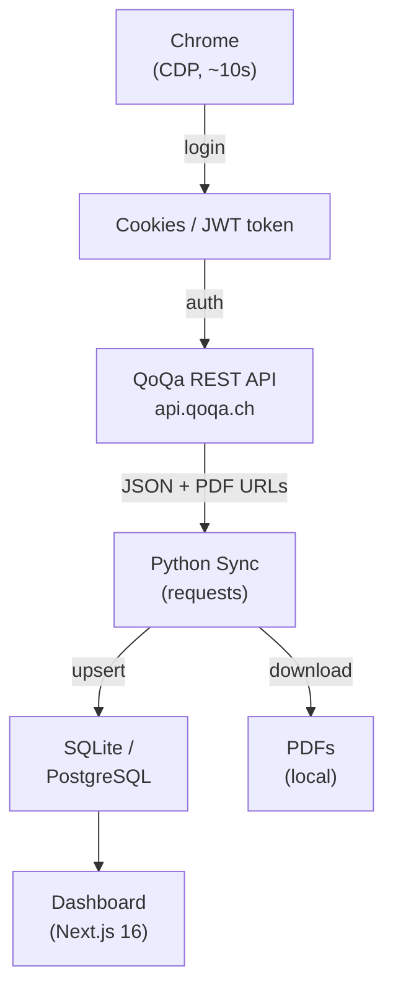

# Architecture

## Overview

The crawler logs in to QoQa.ch via the browser (just for authentication), then
uses the QoQa REST API to fetch all order data and download PDF invoices.



---

## Project structure

```
qoqa-compta/
├── .gitignore
├── renovate.json
├── README.md
├── docs/
│   └── architecture.md       # this file
├── crawler/                  # Python code
│   ├── .env.example
│   ├── requirements.txt
│   ├── crawler/
│   │   ├── __init__.py
│   │   ├── __main__.py       # CLI entry point
│   │   ├── sync.py           # Main synchronisation logic (CLI)
│   │   ├── api.py            # QoQa REST API client
│   │   ├── browser.py        # Browser login only (SeleniumBase CDP)
│   │   ├── db.py             # SQLAlchemy connection and session
│   │   ├── models/
│   │   │   ├── __init__.py
│   │   │   └── order.py      # SQLAlchemy QoqaOrder model
│   │   └── utils/
│   │       ├── __init__.py
│   │       └── pdf_parser.py # PDF parsing with pdfplumber
└── frontend/                 # Next.js application
    ├── .env.example
    ├── package.json
    ├── tsconfig.json
    ├── next.config.ts
    ├── components.json       # shadcn/ui config
    └── src/
        ├── app/
        │   ├── layout.tsx
        │   ├── page.tsx      # Main dashboard
        │   └── api/
        │       └── orders/
        │           └── route.ts
        ├── components/
        │   ├── ui/           # shadcn/ui auto-generated
        │   ├── stats-cards.tsx
        │   ├── spending-chart.tsx
        │   └── orders-table.tsx
        ├── lib/
        │   ├── db.ts         # Drizzle ORM connection (SQLite or PostgreSQL)
        │   └── utils.ts
        └── types/
            └── order.ts
```

---

## Database

The crawler automatically creates the `qoqa_orders` table on first run (via SQLAlchemy `create_all`).

### SQLite (default)

No setup required. The crawler creates the database file and its parent directory
automatically. Both the crawler and frontend must point to the same absolute path.

WAL mode and a 5-second busy timeout are enabled automatically so concurrent
reads (frontend) and writes (crawler) don't deadlock.

### PostgreSQL (optional)

Set `DATABASE_URL` to a PostgreSQL connection string in both `crawler/.env` and
`frontend/.env.local`. Useful when deploying the frontend to Vercel.

### Table structure

```sql
CREATE TABLE qoqa_orders (
    id              SERIAL PRIMARY KEY,
    order_number    VARCHAR(64) UNIQUE NOT NULL,
    order_date      DATE NOT NULL,
    amount_chf      NUMERIC(10, 2) NOT NULL,
    partner_name    VARCHAR(255),
    pdf_filename    VARCHAR(255),
    raw_text        TEXT,            -- JSON from the QoQa API
    created_at      TIMESTAMPTZ DEFAULT NOW(),
    updated_at      TIMESTAMPTZ DEFAULT NOW()
);
```
