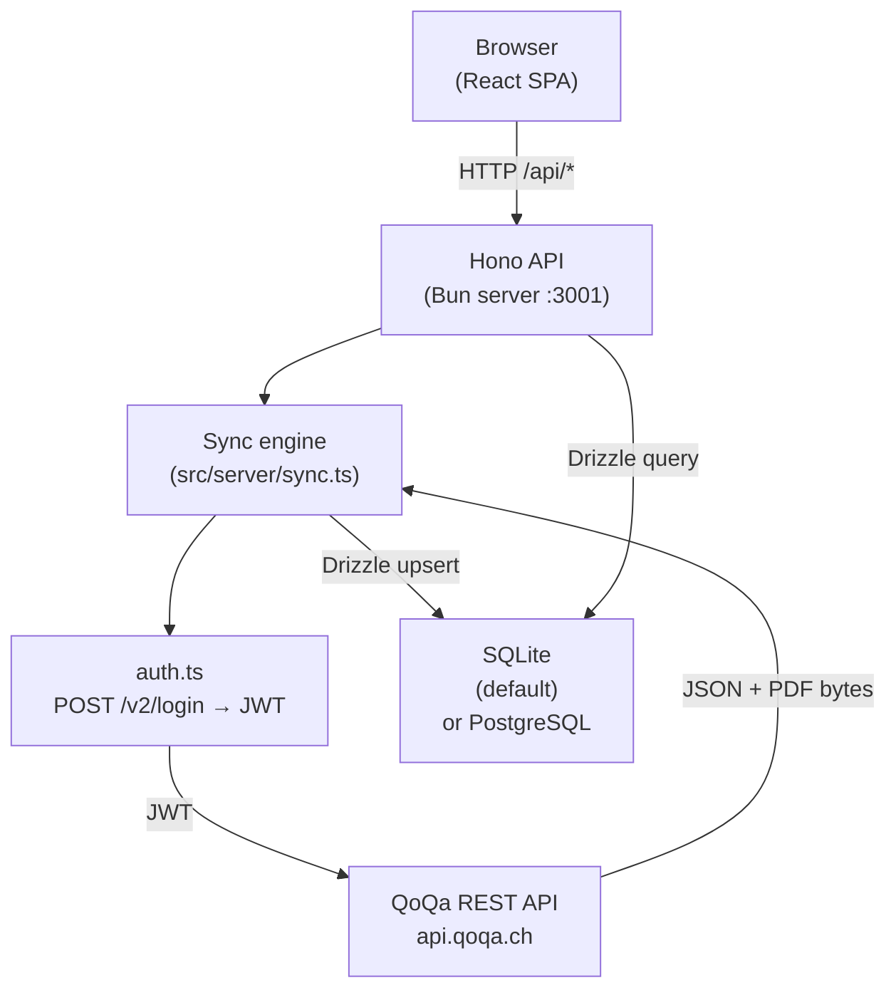

# Architecture

## Overview

QoQa Compta is a single-process desktop-ready app: a [Hono](https://hono.dev/) server running on [Bun](https://bun.sh) serves both the REST API and (in production) the compiled Vite SPA from `dist/`. The sync engine lives inside the same server process.



In **development** Vite's dev server runs on `:3000` and proxies `/api/*` to Hono on `:3001`.
In **production** Hono serves `dist/` directly and falls back to `index.html` for SPA routing.

The codebase is structured for an eventual [ElectroBun](https://github.com/blackboardsh/electrobun) migration: all API calls in the SPA are isolated behind `src/views/lib/api-client.ts`, making the HTTP transport trivially swappable for ElectroBun RPC.

---

## Project structure

```
qoqa-compta/
├── .gitignore
├── renovate.json
├── README.md
├── index.html                    # Vite SPA entry
├── vite.config.ts
├── tsconfig.json
├── drizzle.config.ts
├── docs/
│   └── architecture.md           # this file
└── src/
    ├── server/                   # Hono API + sync engine (Bun)
    │   ├── index.ts              # Server entry point — mounts routes, bootstraps DB
    │   ├── auth.ts               # POST /v2/login → Bearer token
    │   ├── api.ts                # QoQa REST API client (universes, purchases, PDFs)
    │   ├── sync.ts               # Full / incremental sync pipeline (SSE progress)
    │   ├── sync-job.ts           # Running-job state (abort controller, status)
    │   ├── db.ts                 # Drizzle ORM client — SQLite or PostgreSQL
    │   ├── schema.ts             # Drizzle table definitions (dual SQLite + PG)
    │   ├── schema-bootstrap.ts   # CREATE TABLE IF NOT EXISTS bootstrap
    │   ├── queries.ts            # All DB operations (upsert, select, aggregate)
    │   ├── settings.ts           # settings.json read/write (platform-aware path)
    │   └── routes/
    │       ├── dashboard.ts      # GET /api/dashboard
    │       ├── orders.ts         # GET /api/orders, GET /api/orders/:n/pdf, GET /api/orders/csv
    │       ├── sync.ts           # POST /api/sync, DELETE /api/sync, GET /api/sync/stream (SSE)
    │       └── settings.ts       # GET/PUT /api/settings, DELETE /api/settings/database
    ├── views/                    # Vite SPA (React 19)
    │   ├── main.tsx              # React entry point
    │   ├── globals.css           # Tailwind v4 + CSS variable theming
    │   ├── pages/
    │   │   └── DashboardPage.tsx # Main dashboard page
    │   ├── components/
    │   │   ├── ui/               # Base UI primitives (button, input, card, badge)
    │   │   ├── universe-picker.tsx    # Hierarchical universe+subuniverse filter
    │   │   ├── orders-table.tsx       # Searchable, paginated orders table
    │   │   ├── order-pdf-dialog.tsx   # Invoice PDF popup (Base UI Dialog + iframe)
    │   │   ├── spending-chart.tsx     # Monthly + yearly Recharts ComposedChart
    │   │   ├── spending-pie-chart.tsx # Spending breakdown by universe/subuniverse
    │   │   ├── stats-cards.tsx        # Aggregate stat cards
    │   │   ├── date-range-picker.tsx  # Date range filter
    │   │   ├── settings-modal.tsx     # Settings + sync control modal
    │   │   ├── theme-provider.tsx
    │   │   └── theme-toggle.tsx
    │   ├── i18n/
    │   │   ├── index.ts          # react-i18next setup + locale detection
    │   │   └── messages/         # en.json, fr.json, de.json, it.json, rm.json
    │   └── lib/
    │       ├── api-client.ts     # All fetch calls — swap for ElectroBun RPC here
    │       ├── formatter-context.tsx  # React context for fr-CH number/date formatters
    │       ├── formatters.ts     # formatCHF, formatDate, formatMonth
    │       ├── use-filter-state.ts    # URL-state hook for universe/date filters
    │       └── utils.ts          # cn() and other utilities
    └── shared/
        └── types.ts              # Shared TypeScript types (QoqaOrder, AppSettings, …)
```

---

## Sync pipeline

The sync runs inside the Hono server process as an async task managed by `src/server/sync-job.ts`. Progress is streamed to the client via Server-Sent Events (`GET /api/sync/stream`).

```
POST /api/sync { mode: "full" | "update" }
  → auth.ts          — POST auth.qoqa.ch/v2/login → JWT
  → api.ts           — fetchUniverses + sub-universes → upsert to qoqa_universes / qoqa_subuniverses
  → api.ts           — fetchPurchases (paginated list)
  → for each order:
      api.ts         — fetchOrderDetail → extract fields
      api.ts         — downloadPdf → pdf_data bytes
      queries.ts     — upsertOrder (INSERT … ON CONFLICT DO UPDATE)
  → SSE stream emits typed SyncProgressEvent at each step
```

In **update** mode, sync stops after 5 consecutive already-known orders to avoid full re-scans.

---

## Settings

User settings are persisted to a platform-aware JSON file:

| Platform | Path |
|---|---|
| macOS | `~/Library/Application Support/qoqa-compta/settings.json` |
| Windows | `%APPDATA%\qoqa-compta\settings.json` |
| Linux | `$XDG_CONFIG_HOME/qoqa-compta/settings.json` (or `~/.config/…`) |

In **development** only, env vars (`QOQA_EMAIL`, `QOQA_PASSWORD`, `DATABASE_URL`) take precedence over the file.

---

## Database

SQLite is the default (no setup needed). PostgreSQL is supported for remote/shared setups.

### SQLite

The database file defaults to:

| Platform | Path |
|---|---|
| macOS | `~/Library/Application Support/qoqa-compta/qoqa.db` |
| Windows | `%APPDATA%\qoqa-compta\qoqa.db` |
| Linux | `$XDG_DATA_HOME/qoqa-compta/qoqa.db` |

### PostgreSQL

Set `DATABASE_URL` to a `postgresql://…` connection string in the Settings modal (or `.env` in dev).

### Table structure

```sql
-- Orders — one row per QoQa order; pdf_data stores the raw invoice PDF bytes
CREATE TABLE qoqa_orders (
    id               INTEGER PRIMARY KEY AUTOINCREMENT,  -- SERIAL on PG
    order_number     TEXT UNIQUE NOT NULL,
    order_date       TEXT NOT NULL,
    amount_chf       NUMERIC(10, 2) NOT NULL,
    status           TEXT,
    subtotal_chf     NUMERIC(10, 2),
    discount_chf     NUMERIC(10, 2),
    vat_chf          NUMERIC(10, 2),
    delivery_on      TEXT,
    offer_id         TEXT,
    offer_title      TEXT,
    offer_subtitle   TEXT,
    universe         TEXT,          -- universe_tracking_identifier (FK → qoqa_universes)
    subuniverse      TEXT,          -- cleaned identifier (FK → qoqa_subuniverses)
    item_description TEXT,
    invoice_number   TEXT,
    pdf_filename     TEXT,
    pdf_data         BLOB,          -- BYTEA on PostgreSQL
    raw_json         TEXT,
    created_at       TEXT NOT NULL DEFAULT (datetime('now')),
    updated_at       TEXT NOT NULL DEFAULT (datetime('now'))
);

-- Universe lookup — populated from /v2/alerts API on every sync
CREATE TABLE qoqa_universes (
    id                           INTEGER PRIMARY KEY AUTOINCREMENT,
    universe_tracking_identifier TEXT UNIQUE NOT NULL,
    name_fr                      TEXT,
    name_de                      TEXT,
    updated_at                   TEXT NOT NULL DEFAULT (datetime('now'))
);

-- Sub-universe lookup — extracted from push_topics of each universe
CREATE TABLE qoqa_subuniverses (
    id                           INTEGER PRIMARY KEY AUTOINCREMENT,
    identifier                   TEXT UNIQUE NOT NULL,
    name_fr                      TEXT,
    name_de                      TEXT,
    universe_tracking_identifier TEXT NOT NULL,  -- FK → qoqa_universes
    updated_at                   TEXT NOT NULL DEFAULT (datetime('now'))
);
```

### Invoice PDFs

Each row in `qoqa_orders` carries the raw invoice PDF in the `pdf_data` column. List queries never select `pdf_data`; instead they project a `has_pdf` boolean (`pdf_data IS NOT NULL`) to keep the orders endpoint cheap. PDFs are served via `GET /api/orders/:orderNumber/pdf`.

